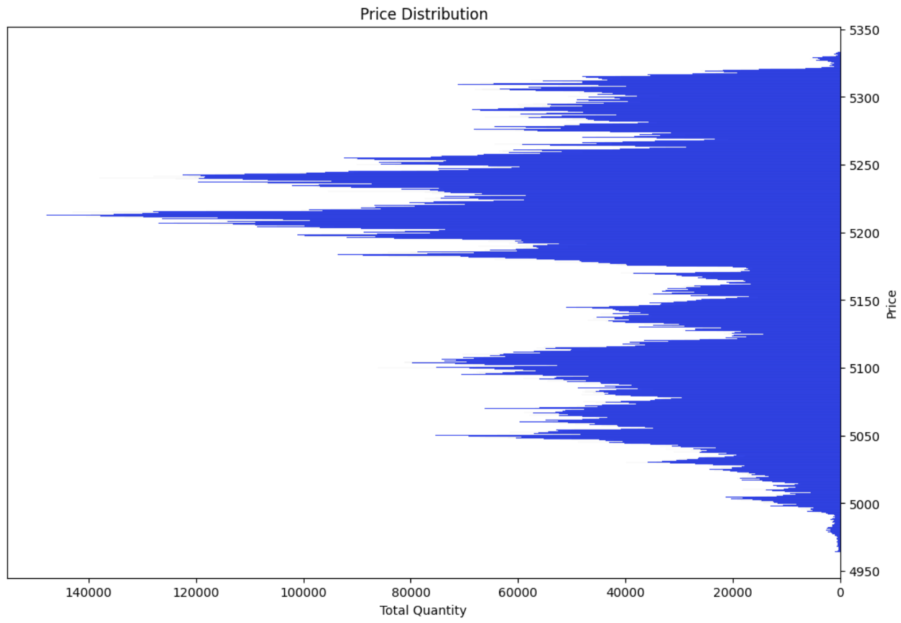

# Sierra Chart Scid to PostgreSQL

## Overview

This project reads Sierra Chart SCID files and writes the data to a PostgreSQL database. The data includes timestamp, price, quantity, and market side (bid/ask).

## Prerequisites

1. Python 3.8+
2. PostgreSQL 12+
3. Required Python libraries:
   - `asyncpg`
   - `polars`
   - `numpy`
   - `pandas`
   - `pytz`


You can install the required libraries using pip:
```bash
pip install asyncpg polars numpy pandas pytz
```

## PostgreSQL Setup

Ensure you have a PostgreSQL database available. You will need the following details:

- **Host**: e.g., `localhost`
- **Port**: e.g., `5432`
- **Username**: e.g., `your_username`
- **Password**: e.g., `your_password`
- **Database name**: e.g., `your_database`


## Project Files

1. `db_create.py`
This script sets up the PostgreSQL table to store SCID data. Update the PostgreSQL connection details and the table name in this script.

2. checkpoint.json
This file tracks the last processed position in the SCID file and whether the initial load is completed.

3. `data_sync.py`
This script reads the SCID file and updates the PostgreSQL table at regular intervals. Update the table name, SCID file path, and other parameters as needed.

## Usage
### Step 1: Set Up the PostgreSQL Table
1. Update the PostgreSQL connection details and table name in `db_create.py`:

   ```python
   # Update these lines with your PostgreSQL credentials
   host="localhost",
   port="5432", 
   user="your_username",
   password="your_password",
   database="your_database"

   # Default table name is "esm24", but should be modified to match the specific contract symbol you are working with.
   CREATE TABLE IF NOT EXISTS "esm24"
    ```
2. Run `db_create.py` to set up the database table:

    ```bash
    python db_create.py
    ```
### Step 2: Initialize the Checkpoint File
1. Ensure `checkpoint.json` is set up for the initial load. The table name in `checkpoint.json` should match the table name you set in `db_create.py`. For the first run, use the following configuration:

   ```json
   {"esm24": {"last_position": 0, "initial_load_done": false}}
    ```
    Replace "esm24" with your specific table name if it's different.

### Step 3: Start Data Synchronization
1. Update the table name and SCID file path in `data_sync.py`:

   ```python
    table_name = "esm24"  # Specify the unique table name for your data.
    scid_file = "/Volumes/[C] Windows 11/Sierra/Data/ESM24-CME.scid"  # Set the file path to your SCID file.

2. Set the update interval in `data_sync.py` to continuously update data from the SCID file. 
    Here, "1" means pause the execution for 1 second between updates:
    ```python
    while True:
    asyncio.run(main(table_name, scid_file, initial_load=False))
    time.sleep(1)  # Pause for 1 second before the next update. Adjust as needed.
    ```

3. Run `data_sync.py` to start synchronizing data (the initial run may take some time depending on the SCID file size and your system performance etc., please be patient):
    ``` bash
    python data_sync.py
    ```

### Data Validation
To validate the data, use the provided Jupyter Notebook `data_check.ipynb`. This notebook connects to the PostgreSQL database, retrieves data, and performs basic validation checks.

Example Output:

```
min value:  4963.5
max value:  5333.5
min value of quantity:  1
max value of quantity:  2962
min value of side:  0
max value of side:  1
min value of actual_datetime:  2024-02-22 18:07:25.394000-06:00
max value of actual_datetime:  2024-05-10 15:59:59.478001-05:00
total rows count:  43818522
Number of null entries:
 price       0
quantity    0
side        0
dtype: int64
Unique values in 'side':  [1 0]
Distribution of 'price' values:  price
5211.75    95325
5212.50    95262
5211.50    93263
5212.00    90905
5212.75    90141
           ...  
4963.75      173
5330.75      126
5333.25      113
4963.50       34
5333.50        4
Name: count, Length: 1481, dtype: int64
```

Example Plot:

Here is an example plot of the price distribution.


